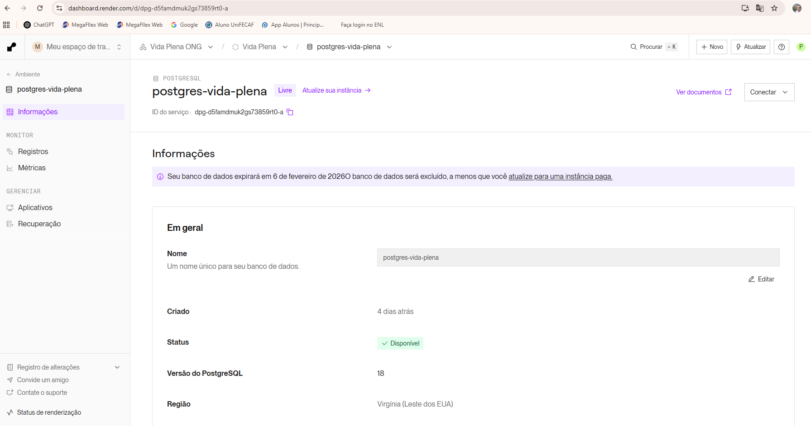
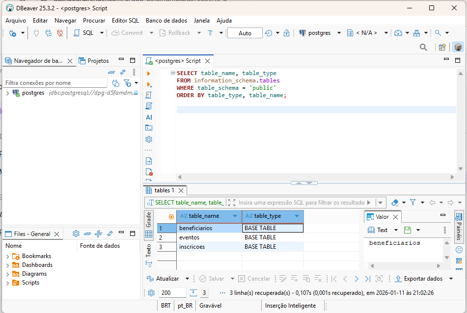
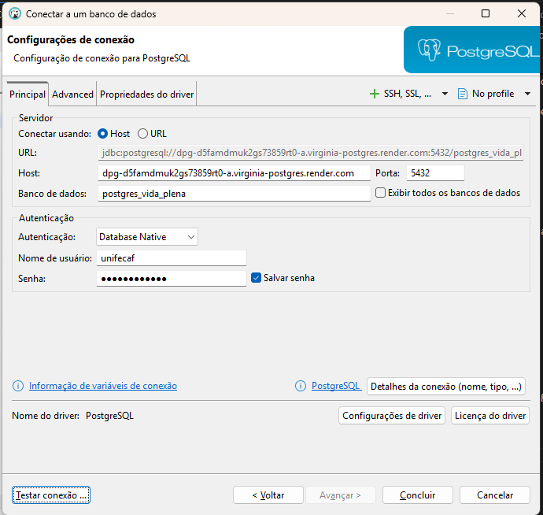
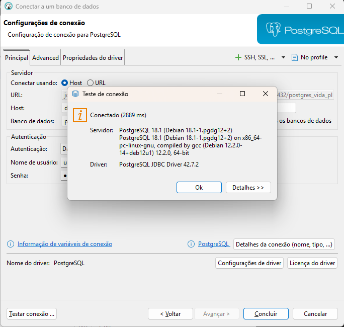
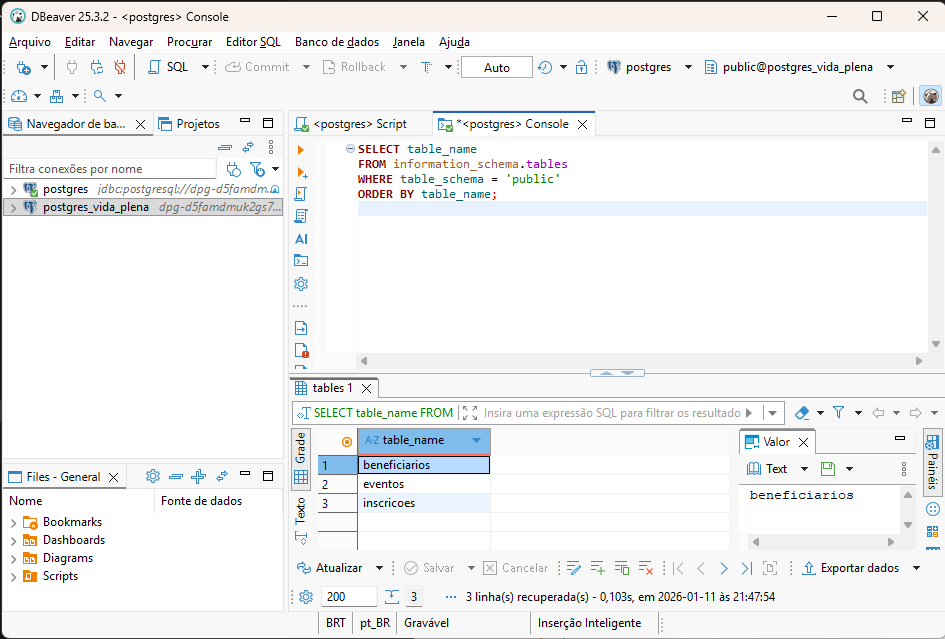
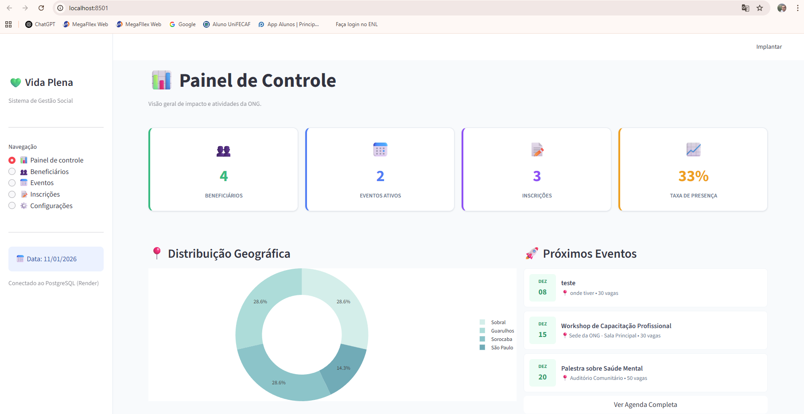
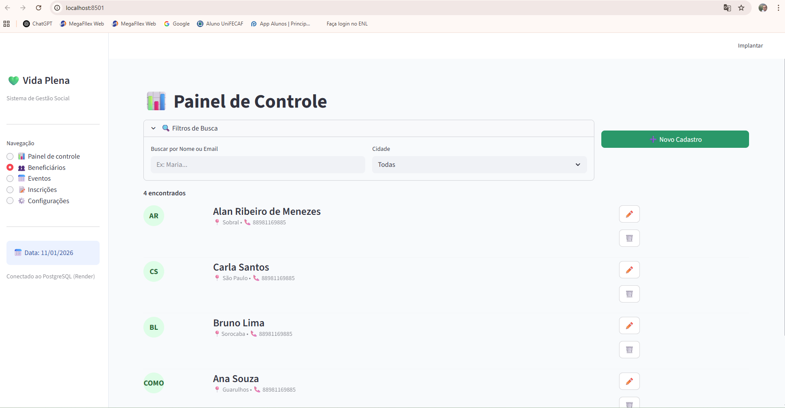
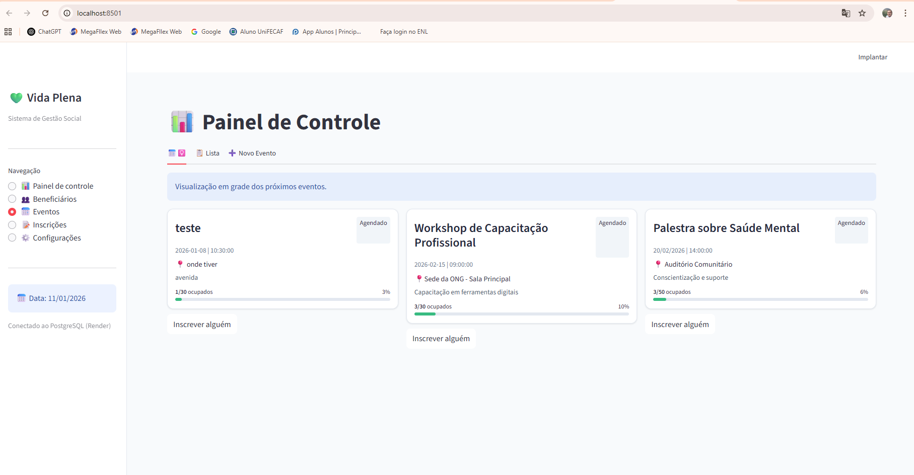
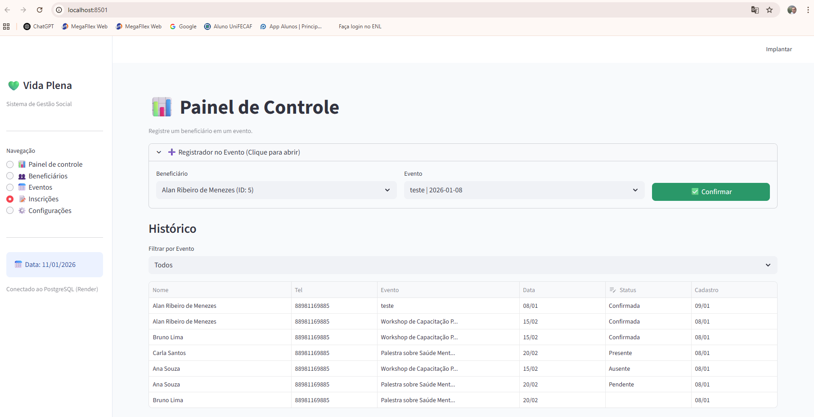
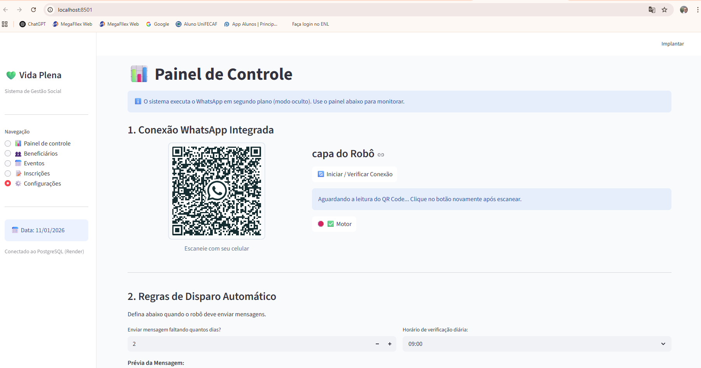

🧾 Relatório Técnico – Sistema de Gestão ONG Vida Plena

Aluno: Alan Ribeiro de Menezes
Disciplina: Banco de Dados Visuais e Ferramentas Integradas
Data: 10/01/2026

1. Levantamento de Requisitos

O levantamento de requisitos foi realizado a partir da análise do funcionamento operacional da ONG Vida Plena, que anteriormente utilizava planilhas descentralizadas e comunicação informal por aplicativos de mensagens, o que ocasionava duplicidade de dados, inconsistências e dificuldades na gestão das informações.

O processo iniciou-se com observação direta das rotinas administrativas, análise documental das planilhas existentes e diálogo com os voluntários responsáveis pelas atividades. A partir dessa análise, foram definidos os seguintes requisitos principais:

Cadastro único e centralizado de beneficiários

Controle de eventos e gestão de vagas

Registro de inscrições e presença

Automação da comunicação com os participantes

Redução de retrabalho e erros manuais

Evolução das Ferramentas

O projeto passou por diferentes etapas tecnológicas até alcançar sua arquitetura final:

Airtable – organização inicial dos dados.

Base44 – tentativa de aprimorar a visualização e a experiência do usuário.

Antigravity – consolidação da aplicação visual, oferecendo maior desempenho e controle da interface.

PostgreSQL (Render.com) – banco de dados relacional definitivo, hospedado na nuvem, garantindo segurança, disponibilidade e integridade das informações.

Essa evolução permitiu validar soluções, eliminar gargalos técnicos e alcançar uma arquitetura estável e escalável.

2. Raciocínio por Trás da Modelagem do Banco Visual

A modelagem foi planejada para transformar dados tabulares em informação visual clara e acessível. Abandonou-se a lógica de planilha única para adotar um modelo relacional estruturado, permitindo maior integridade dos dados.

A interface foi construída utilizando elementos visuais como cards, painéis e dashboards, favorecendo a leitura rápida das informações, principalmente em dispositivos móveis, e reduzindo o tempo de operação dos usuários.

3. Justificativa da Escolha das Ferramentas

A escolha por uma solução baseada em Python, com interface visual desenvolvida no Antigravity e banco de dados PostgreSQL, fundamenta-se nos seguintes fatores:

Autonomia e propriedade total dos dados.

Possibilidade de integração avançada, incluindo automação de comunicação via WhatsApp.

Escalabilidade do sistema sem custos adicionais de licenciamento.

Maior controle sobre segurança, permissões e integridade da informação.

4. Descrição da Estrutura Relacional

O sistema é composto pelas seguintes entidades:

Beneficiários

Atributos: ID (PK), Nome, Idade, Telefone, Região.

Eventos

Atributos: ID (PK), Nome, Data, Quantidade de Vagas, Status.

Inscrições

Tabela associativa responsável pelo relacionamento N:N entre beneficiários e eventos.

Atributos: ID, FK_Beneficiário, FK_Evento, Status de Presença, Data de Inscrição.

Relacionamentos

Beneficiários → Inscrições (1:N)

Eventos → Inscrições (1:N)

Esse modelo garante integridade referencial, evita duplicidade de registros e preserva o histórico institucional da ONG.

5. Ética e Segurança da Informação

O desenvolvimento seguiu princípios éticos e normas de proteção de dados, alinhados à LGPD e ao conceito de Privacy by Design, adotando:

Coleta apenas de informações essenciais (minimização de dados).

Proteção de credenciais por meio de variáveis de ambiente.

Controle de acesso conforme função do usuário.

Uso de chaves primárias, estrangeiras e restrições de integridade para garantir confiabilidade e segurança.

6. Acesso ao Projeto

O projeto completo está disponível publicamente no GitHub:

https://github.com/ReilanSobral/Banco-de-dados/tree/main/arquivos/Banco-de-dados

Nesse repositório o professor poderá consultar os códigos, estrutura do banco de dados e documentação complementar.

7. Acesso ao Banco de Dados Online e Evidências Visuais

O sistema utiliza um banco de dados PostgreSQL hospedado na plataforma Render.com, permitindo acesso remoto para validação e testes.

Dados de Conexão para Avaliação

(As credenciais completas foram fornecidas ao professor em mensagem privada, conforme boas práticas de segurança.)

Host: dpg-d5famdmuk2gs73859rt0-a.virginia-postgres.render.com

Porta: 5432

Database: postgres_vida_plena

Usuário: unifecaf

Password: TesteBanco1!

SSL: required

Evidências de Funcionamento e o banco ficará disponivel em render.com ate o dia 06/02/2026

As imagens a seguir demonstram o acesso ao banco via DBeaver, evidenciando a estrutura das tabelas e conexão ativa:

(As imagens encontram-se anexadas neste relatório e também disponíveis no repositório do projeto.)

Conclusão

O sistema desenvolvido representa uma evolução significativa na gestão da ONG Vida Plena, proporcionando organização, segurança, confiabilidade e escalabilidade. O projeto demonstra a aplicação prática dos conceitos de levantamento de requisitos, modelagem relacional, banco de dados visuais e responsabilidade ética na gestão da informação.

Imagens de referencia do sistema em funcionamento:

Sistema desenvolvido por Alan Ribeiro de Menezes
Disciplina: Banco de Dados Visuais e Ferramentas Integradas
Data: 10/01/2026
